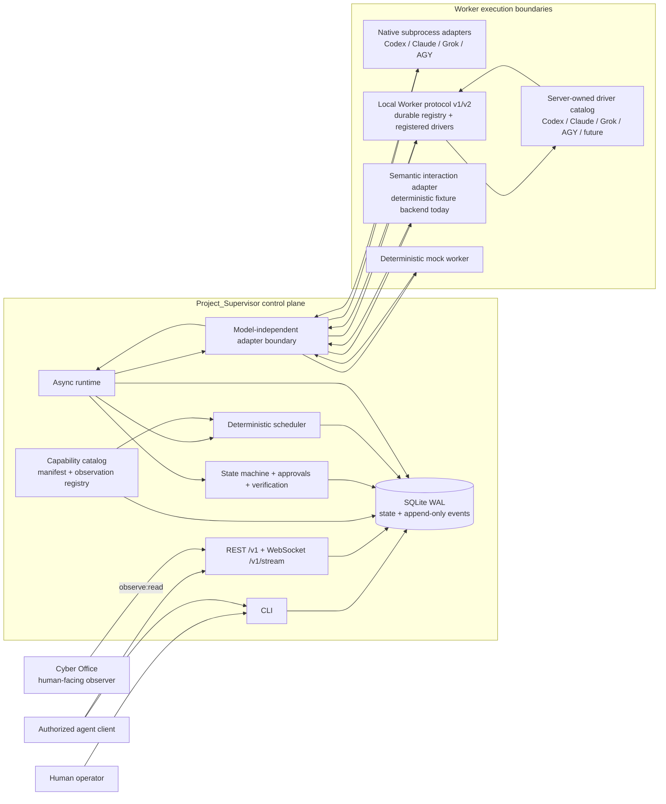
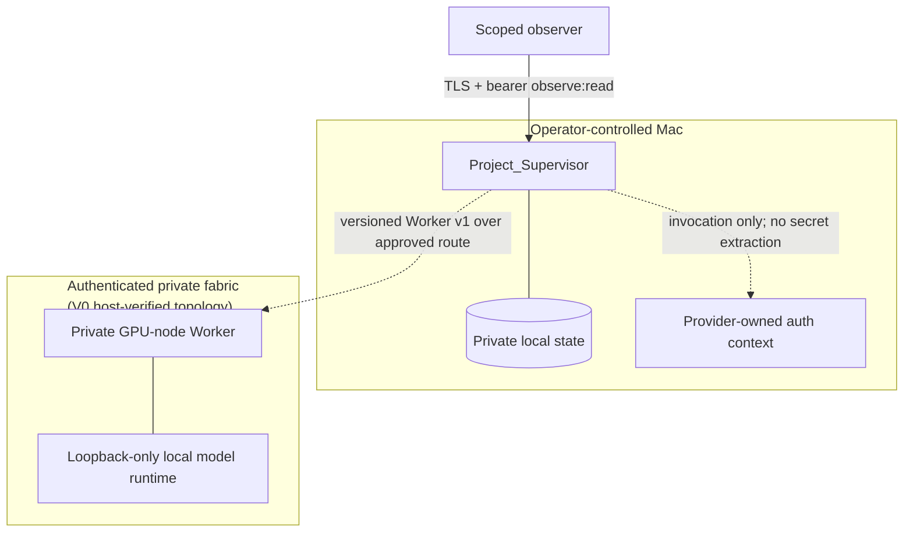

# Architecture

This document describes the compatibility-preserved V0 core, V0.1 universal-fabric foundations,
and the implemented V0.3 development slices for capability routing and semantic interaction. It is
not a declaration that every deployment or real-host gate has passed; see
[`COMPATIBILITY.md`](COMPATIBILITY.md), [`GOAL_PROGRESS.md`](GOAL_PROGRESS.md), and
[`BLOCKERS.md`](BLOCKERS.md) for verification status.

The V0.3-dev Phase 2 extension is documented in
[`MULTI_NODE_EXECUTION_PLANE.md`](MULTI_NODE_EXECUTION_PLANE.md). Transport discovery,
capability metadata, runtime executability, authorization, platform approval, and provider
invocation evidence are separate facts; none may be inferred from another.

## System context



The arrows show control or data flow, not implicit trust. Cyber Office (never “Supervisor UI”) and
other observers read
projections; they do not become a second source of truth. Provider sessions and raw output remain
provider-specific below the adapter boundary. Normalized state and events are committed to SQLite.

## Runtime task flow

```mermaid
sequenceDiagram
    participant C as Authorized client
    participant R as Supervisor runtime
    participant S as Scheduler / policy
    participant D as SQLite store
    participant W as Worker adapter
    participant O as Read-only observer

    C->>R: Submit explicit task requirements
    R->>D: Persist task + creation event
    R->>S: Route against one frozen worker snapshot
    S-->>R: Selected/rejected candidates + reasons
    R->>D: Persist routing decision
    R->>D: Claim Task + execution lease; create Worker run
    R->>D: Persist provider-job intent + idempotency key
    R->>W: Start bounded WorkerRequest
    W-->>R: Opaque provider job handle (when supported)
    R->>D: Bind sanitized handle (when returned)
    loop Output and heartbeat
        W-->>R: Normalized WorkerEvent
        R->>D: Append sanitized event
        O->>D: Read projection / resume after sequence
    end
    W-->>R: Terminal WorkerResult
    R->>D: Persist session, usage, result, and state
    R->>R: Deterministic verification / definition of done
    R->>D: Persist terminal outcome or explicit non-terminal state
```

State transitions are authoritative only after they commit. Worker prose cannot change a task
state, approve a RED action, or satisfy a definition of done by itself.

## Component responsibilities

| Component | Owns | Must not own |
|---|---|---|
| Domain and state machine | Stable entities, enums, legal transitions | Provider CLI flags or UI state |
| Scheduler | Hard constraints, deterministic scoring, explainable routing | Process execution or mutable global state |
| Hybrid Engine | Explainable bounded workload decomposition and topology | Concrete Worker selection, authority, or dispatch |
| Cluster DAG expander | Typed roles, dependencies, replicas, spawn-policy bounds, reviewer-independence constraints | Worker scoring, unbounded fanout/recursion, or lease bypass |
| Capability fabric | Versioned provider-independent vocabulary, immutable Worker manifests, append-only health/quota/load observations | Provider identity, permission grants, or invented availability/cost |
| Local-model profiler | Evidence-backed observed properties and conservative recommendations | Credential reads, endpoint probes during discovery, invented capacity, or silent setting changes |
| Runtime | Dispatch, concurrency, cancellation, result orchestration | Credential acquisition or model-specific parsing |
| Store | Migrations, durable state, event sequence, token hashes | Chat history as state or plaintext bearer tokens |
| Native adapters | Process groups, streaming capture, provider parsing, redaction | Global scheduling, approval decisions, or unadvertised recovery semantics |
| Local Worker adapter/daemon | Versioned HTTP boundary, read-only enforcement, v2 durable launch registry, registered server-owned driver profiles, job reconcile/resume/collect | Client-supplied executable/argv/env/cwd, public network exposure, code-writing delegation, or unobserved provider idempotency claims |
| Node recovery monitor | Due-policy polling, fenced leases, checkpoints, typed runtime-start dispatch | Credentials, arbitrary commands, or implicit grants |
| Verification | Deterministic acceptance checks and evidence | Subjective model self-attestation |
| Interaction fabric | Structured semantic plans, resource fencing, observe/act/postverify loop, sanitized trajectories and skill hints | Prompt-derived authority, coordinate-first automation, or claims of an unimplemented OS/browser/VLM backend |
| Project_Bridge | Optional bounded/hash-aware derived transfer and semantic support accounting | Canonical state, permissions, or mutation from model output |
| REST/WebSocket API | Read-only projections, replay cursor, scoped observation | Arbitrary shell/filesystem/model access |
| Cyber Office | Human-readable live observation | Canonical state or task mutation in V0 |

## Data and recovery model

- SQLite WAL is the canonical store. Lifecycle mutations that emit normalized events commit the
  state change and event in one transaction.
- `events.sequence` is the global monotonic replay cursor. Delivery is at-least-once; consumers
  deduplicate by sequence/event identifier.
- Provider session IDs remain opaque. They may be captured for resume but are never parsed for
  authorization.
- Unknown usage, quota, cost, or reset data remains explicitly unavailable. Zero is a real value,
  not a substitute for missing telemetry.
- Runtime evidence is sanitized before it is eligible for `artifacts/goal-run/`; raw credential
  stores and provider authentication material are never evidence inputs.
- Dispatch writes provider-job intent and an idempotency key before adapter launch, then binds an
  opaque private handle. Canonical lookup identifiers remain exact; metadata is sanitized and the
  remote API uses a separate allowlist. This is durable intent, not an atomic transaction with the
  provider.
- Crash recovery first reconciles non-terminal jobs whose adapters truthfully advertise the needed
  capability. Task execution lease generations fence stale owners. Known running jobs can be
  reattached; repeatably collectable terminal jobs can be ingested; only authoritative
  `providerNotFound` permits automatic single-job retry.
- Ambiguous/unreachable provider state and unsupported resume/collection park work in `WAITING`,
  create a structured escalation, and suppress fresh dispatch.
  Native CLI adapters remain non-resumable after restart. See [`RECOVERY.md`](RECOVERY.md).
- Recovery verifies the current adapter type, instance identity, and capabilities against the
  persisted launch contract before querying a provider. Definitive reconciliation resolves prior
  transient escalations; collected provider state cannot be reopened by a late observation.
- Canonical result ingestion/finalization is idempotent. External launch and cancellation are only
  best-effort unless the provider itself enforces the advertised idempotency key. Local Worker v2
  enforces one logical launch per key inside one healthy durable daemon authority; v1 and native CLI
  adapters do not inherit that claim.
- A production Local Worker identity keeps `node_id`, stable `authority_id`/`registry_id`, ephemeral
  `runtime_instance_id`, Worker/adapter identity, Supervisor run, provider-job ID, launch generation,
  and driver-profile revision/fingerprint separate. The daemon owns executable resolution and argv;
  the HTTP request can select only a registered semantic driver ID.
- Run API projections expose only a redacted `providerJob` subset. Private adapter metadata, raw
  idempotency keys, endpoint/process identity, and escalation details remain in local canonical
  state.
- Optional Task verification scopes snapshot criteria definitions plus Task, plan, and steering
  versions. Dispatch captures that scope on every Worker run; apply requires the verifier to echo
  the exact scope, semantic Task revision, and source attempt it evaluated. A stale result cannot
  satisfy a newer scope/attempt, iteration steering epochs are checked, and scoped verification
  never rewrites project-level criterion templates.
- Capability manifests keep static ability and billing relationship separate from dynamic health,
  subscription availability, quota, and load. Immutable revisions use a generation-CAS head;
  observations are append-only and `UNKNOWN` remains explicit. See
  [`CAPABILITY_FABRIC.md`](CAPABILITY_FABRIC.md).
- Semantic interaction executions accept only a bounded structured execution specification, acquire
  generation-fenced semantic resources, and require a fresh observation after every action before
  recording success. SQLite persists sanitized semantic state rather than screenshots, typed text,
  or geometry. This is currently proven with an offline deterministic fixture, not a real UI
  backend. See [`INTERACTION_FABRIC.md`](INTERACTION_FABRIC.md).

## Trust and network boundaries



Loopback is the safe default. Non-loopback operation requires an operator-approved authenticated
private transport and TLS. The V0 Mac-to-PC Tailscale path has sanitized host evidence, but Tailscale
is a transport implementation rather than an architectural dependency. Future adapters normalize
authentication, encryption, peer identity, reachability, latency, and health. Public and ordinary-LAN
exposure remain outside the supported design.

## Extension seams

New workers implement the model-independent adapter contract and retain provider-specific formats
below that seam. Capability identity is independent of provider identity, and an interaction
channel is an execution medium rather than a Worker. New clients consume `/v1` projections and the
event cursor. Future mutation APIs or
MCP surfaces require separate capability scopes, durable approval enforcement, audit events, and an
ADR before they are considered part of the stable V0 contract.

V0.1 adds documentation/contract foundations for a portable Node Runtime, capability-scoped
Privilege Broker, universal bootstrap, transport abstraction, and Hybrid Engine telemetry. These
remain FOUNDATION unless `CAPABILITIES.md`, code/tests, and sanitized acceptance evidence all show
implementation. Project_Bridge is an optional cognitive/communication plane and never replaces the
Supervisor control plane or canonical structured state.
