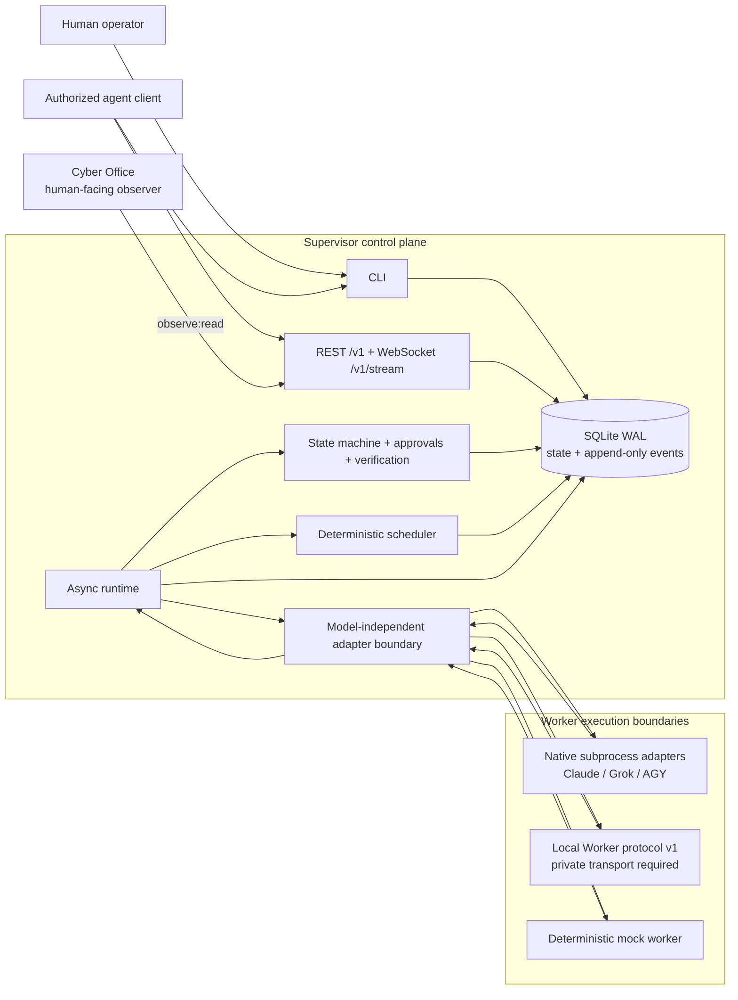
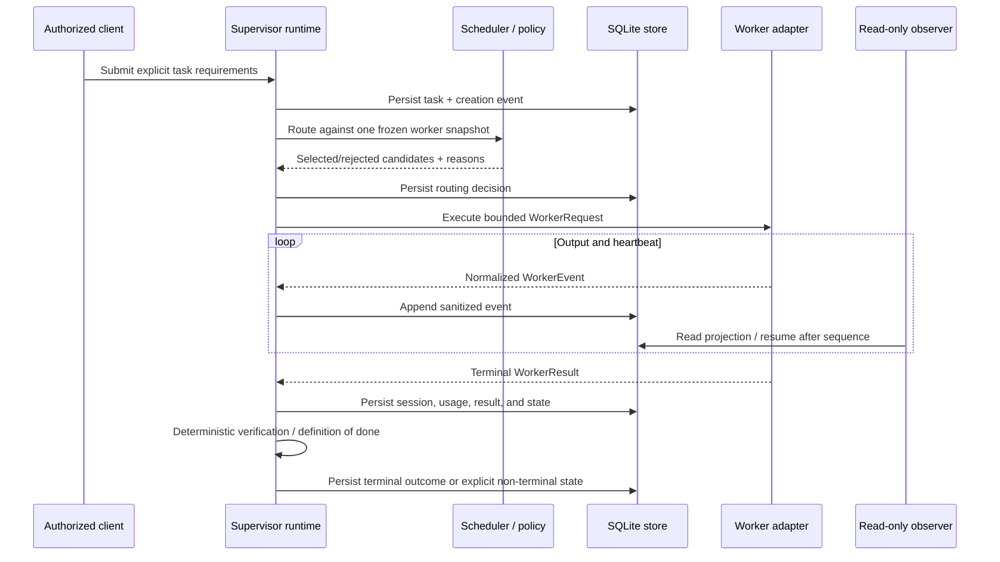

# Architecture

This document describes the compatibility-preserved V0 core and V0.1 universal-fabric foundations.
It is not a declaration that every V0.1 deployment gate has passed; see
[`COMPATIBILITY.md`](COMPATIBILITY.md), [`GOAL_PROGRESS.md`](GOAL_PROGRESS.md), and
[`BLOCKERS.md`](BLOCKERS.md) for verification status.

## System context

The arrows show control or data flow, not implicit trust. Cyber Office (never “Supervisor UI”) and
other observers read
projections; they do not become a second source of truth. Provider sessions and raw output remain
provider-specific below the adapter boundary. Normalized state and events are committed to SQLite.

## Runtime task flow

State transitions are authoritative only after they commit. Worker prose cannot change a task
state, approve a RED action, or satisfy a definition of done by itself.

## Component responsibilities

| Component | Owns | Must not own |
|---|---|---|
| Domain and state machine | Stable entities, enums, legal transitions | Provider CLI flags or UI state |
| Scheduler | Hard constraints, deterministic scoring, explainable routing | Process execution or mutable global state |
| Runtime | Dispatch, concurrency, cancellation, result orchestration | Credential acquisition or model-specific parsing |
| Store | Migrations, durable state, event sequence, token hashes | Chat history as state or plaintext bearer tokens |
| Native adapters | Process groups, streaming capture, provider parsing, redaction | Global scheduling or approval decisions |
| Local Worker adapter | Versioned HTTP boundary and read-only local-AI enforcement | Public network exposure or code-writing delegation |
| Verification | Deterministic acceptance checks and evidence | Subjective model self-attestation |
| REST/WebSocket API | Read-only projections, replay cursor, scoped observation | Arbitrary shell/filesystem/model access |
| Cyber Office | Human-readable live observation | Canonical state or task mutation in V0 |

## Data and recovery model

- SQLite WAL is the canonical store. State mutations and their normalized events share a
  transaction.
- `events.sequence` is the global monotonic replay cursor. Delivery is at-least-once; consumers
  deduplicate by sequence/event identifier.
- Provider session IDs remain opaque. They may be captured for resume but are never parsed for
  authorization.
- Unknown usage, quota, cost, or reset data remains explicitly unavailable. Zero is a real value,
  not a substitute for missing telemetry.
- Runtime evidence is sanitized before it is eligible for `artifacts/goal-run/`; raw credential
  stores and provider authentication material are never evidence inputs.
- Crash recovery reconciles persisted non-terminal runs with actual process/worker state. Recovery
  behavior still requires release-gate verification; architecture alone is not proof.

## Trust and network boundaries

Loopback is the safe default. Non-loopback operation requires an operator-approved authenticated
private transport and TLS. The V0 Mac-to-PC Tailscale path has sanitized host evidence, but Tailscale
is a transport implementation rather than an architectural dependency. Future adapters normalize
authentication, encryption, peer identity, reachability, latency, and health. Public and ordinary-LAN
exposure remain outside the supported design.

## Extension seams

New workers implement the model-independent adapter contract and retain provider-specific formats
below that seam. New clients consume `/v1` projections and the event cursor. Future mutation APIs or
MCP surfaces require separate capability scopes, durable approval enforcement, audit events, and an
ADR before they are considered part of the stable V0 contract.

V0.1 adds documentation/contract foundations for a portable Node Runtime, capability-scoped
Privilege Broker, universal bootstrap, transport abstraction, and Hybrid Engine telemetry. These
remain FOUNDATION unless `CAPABILITIES.md`, code/tests, and sanitized acceptance evidence all show
implementation. Project_Bridge is an optional cognitive/communication plane and never replaces the
Supervisor control plane or canonical structured state.
