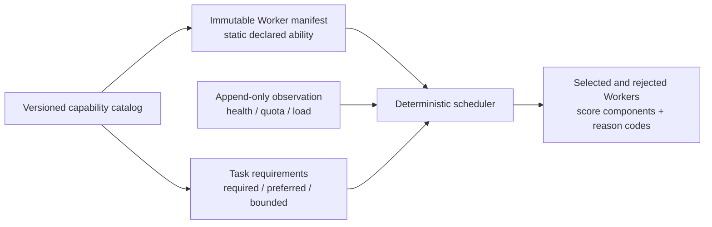

# Provider-independent capability fabric

This document describes the implemented V0.3 development slice for declaring Worker abilities and
routing Tasks against them. It is deliberately provider-independent: a capability says **what** a
Worker can do, while a provider, adapter, model, Node, and account say **where and how** that Worker
runs.

A capability claim is not an authorization grant. Permission class, human approval, privacy,
code-write policy, resource state, and other hard constraints remain independently authoritative.
No Worker or model can gain authority by adding a capability name to its own output.

## Contract layers

The layers have different responsibilities:

- `CapabilityDefinition` gives a canonical semantic ID, aliases, and bounded parameter schema.
- `CapabilityCatalog` is immutable and versioned. It canonicalizes aliases and rejects unknown or
  conflicting claims.
- `WorkerManifest` records static Worker identity and declared capability limits. Its canonical JSON
  has a `sha256:` digest and a monotonically increasing manifest revision.
- `WorkerDynamicState` records observations that can change without changing the manifest: health,
  health freshness, subscription availability, quota state/freshness, load, active jobs, and
  observation time.
- `TaskRequirements` separates required capabilities, preferred capabilities, parameterized
  requirements, locality, quality/cost bounds, optional reproducibility override, and required
  manifest/catalog versions.
- `DeterministicScheduler` applies hard constraints first, then transparent weighted scoring, then
  a stable Worker-ID tie-break.

The current manifest schema is `worker-capability-manifest/v1`; the initial catalog is
`fabric-capabilities/v1`.

## Initial vocabulary and aliases

Capability identifiers are data, not a closed provider enum. The initial provider-independent set
includes:

- `edit-code`, `run-tests`, `review-code`, and `verify-result`
- `read-text`, `read-image`, `read-video`, and `read-youtube`
- `web-search` and `search-x`
- `generate-image`, `generate-video`, and `generate-3d`
- `use-local-gpu` and `use-local-model`
- `control-browser` and `control-gui`

It also retains general orchestration capabilities such as `analysis`, `reasoning`, `research`,
`architecture`, `structured-output`, and `long-context`. Compatibility aliases are canonicalized;
for example, legacy `coding` resolves to `edit-code`, and legacy `review` resolves to
`review-code`. Extending a catalog creates a new catalog version rather than changing an already
interpreted vocabulary in place.

## Parameterized capability matching

Capability parameters are bounded JSON scalars with catalog-defined type, range, allowed-value,
length, and pattern checks. Parameter aliases are canonicalized before comparison. Unknown
parameters, missing required parameters, invalid types, and conflicting replays fail closed.

For routing, numeric Worker parameters represent an advertised upper limit and must be greater than
or equal to the Task request. Boolean and string parameters must match exactly. For example, a
`read-video` Worker advertising `max-duration-seconds: 600` can satisfy a request for 300 seconds,
but not 601 seconds. Its `local-only` boolean must match the requested value exactly. Top-level Task
`local_only` remains a separate hard locality constraint.

Legacy Worker snapshots remain routable for unparameterized requirements so existing deployments
do not break. They cannot prove parameterized capability limits; a Task that requires such proof is
rejected with a machine-readable reason until a versioned manifest is present.

## Static manifest and dynamic observation

Static manifest fields include Worker, Node, provider and adapter identities; capability claims;
model identifiers; locality and privacy class; billing mode; optional known incremental cost; and
maximum concurrency. Subscription availability is intentionally **not** static manifest truth.

Dynamic observations record health, quota, subscription availability, load, active jobs, freshness,
and observation time. `UNKNOWN` is a first-class value. Missing quota, cost, subscription, or health
evidence is never rewritten to free, available, unlimited, or zero.

SQLite preserves this split:

- `worker_capability_manifests` is immutable and revisioned.
- `worker_capability_manifest_heads` is a narrow generation-CAS pointer to the active revision.
- `worker_capability_observations` is append-only and linked to the manifest it observed.

Registration checks canonical Worker/Node/provider identity, sequential revisions, digest replay,
and expected head generation. Re-registering the current identical digest is idempotent; an older
manifest cannot silently become current again. The State Store merges the active manifest and
latest dynamic observation into the frozen `WorkerSnapshot` used for routing.

## Deterministic routing policy

Hard rejection includes, as applicable:

- Node or Worker unavailable, observable resource exhaustion, unhealthy Worker, or concurrency
  limit reached
- unsupported manifest/catalog version, invalid/unknown capability contract, missing capability,
  or unsatisfied parameter limit
- local-only, privacy, code-write, context-window, minimum-quality, or maximum-incremental-cost
  mismatch
- missing durable human approval for RED work

An explicit Worker override narrows reproducibility to that Worker; it does not bypass any safety
constraint. Unknown incremental cost cannot satisfy a Task cost ceiling.

Eligible Workers receive explainable score components for required/preferred capability fit,
quality, availability, quota health/freshness, cost, latency, reliability, Node and Worker load,
privacy, context, and health. The default billing preference is:

1. subscription billing with a current `available` observation
2. declared local/free execution
3. other paid execution
4. metered execution
5. unknown billing state

This ordering is a preference, not fabricated accounting. It does not override hard constraints or
claim that a subscription has unlimited remaining quota.

## Observation API

Scoped `observe:read` clients can inspect safe semantic projections through:

- `GET /v1/fabric/capabilities`
- `GET /v1/fabric/routing`

The capability projection exposes the active semantic manifest head and latest bounded observation.
The routing projection exposes selected Worker IDs, scores, and stable rejection codes. Private raw
manifest/state JSON and detailed internal routing explanation are not exposed by these endpoints.

## Current limitations

- The initial catalog is a code-owned vocabulary and extension seam, not a remotely installable
  plugin registry or permission system.
- Registering a manifest records a validated declaration; it does not independently probe a
  provider, authenticate an account, or prove provider-native features.
- Cost, quota, subscription, health, quality, and load are only as reliable and fresh as their
  recorded configuration or observation. The implementation does not infer missing values;
  unknown remains unknown.
- Compatibility snapshots without a versioned manifest cannot satisfy parameterized requirements
  or manifest-version gates.
- Routing weights are fixed policy inputs. The implementation does not perform opaque adaptive
  learning or allow an LLM to change safety constraints.
- The read APIs are observation surfaces. They do not grant capability registration, scheduling,
  provider access, or privileged action authority.

Provider-specific invocation, durable job recovery, and authentication remain below the Worker
adapter boundary. See [`ARCHITECTURE.md`](ARCHITECTURE.md), [`SCHEDULER.md`](SCHEDULER.md), and
[`CAPABILITY_MODEL.md`](CAPABILITY_MODEL.md) for those separate concerns.
