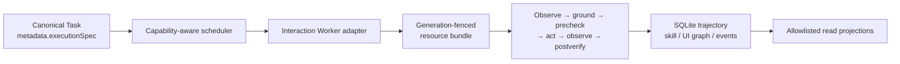

# Semantic interaction fabric

This document describes the implemented V0.3 development slice for bounded semantic interaction.
It proves the Supervisor execution, fencing, verification, persistence, and observation contracts
with a deterministic local fixture. It does **not** claim production control of a real operating
system, browser, accessibility tree, local screen parser, or vision model.

## Identities and boundaries

An Interaction channel is not a Worker:

- A **Worker** is the schedulable execution identity behind a Worker adapter.
- An **Interaction execution** is one bounded, structured `ui-plan/v1` carried by that Worker run.
- A **channel** describes the observation/action medium, such as API, DOM, accessibility, or a local
  parser. It is an attribute of the plan and adapter, not a provider or independently schedulable
  agent.
- A **resource** is a semantic exclusive-use identity such as a desktop session, browser context,
  window, mouse, keyboard, clipboard, or display.

A Worker may eventually support more than one channel, and multiple Workers may implement the same
capability. Scheduler capability matching chooses a suitable Worker; channel-specific execution
remains below that boundary.

## Structured execution authority

The only execution authority accepted by `InteractionWorkerAdapter` is the bounded object at
`WorkerRequest.metadata["executionSpec"]`. It must validate as `ui-plan/v1`. The adapter does not
interpret the Worker prompt and does not reconstruct authority from Task prose.

The strict specification bounds total encoded bytes, milestones, actions, strings, timeouts, and
resource count; rejects unknown fields; requires scoped machine identities; and validates each
locator, action, precondition, and postcondition. Production code-write requests are rejected.
Natural-language text may describe intent elsewhere, but it cannot silently become permission to
click, type, or invoke an application action.

The current Worker accepts deterministic local channels: `api`, `dom`, `accessibility`, and
`localParser`. Although the domain vocabulary reserves `vlm` and `manual` sources for future work,
the current strict execution specification rejects them as execution channels.

## Semantic identity before coordinates

Grounding prefers stable semantic information in this order:

1. scoped semantic action
2. stable element ID
3. exact role and name
4. accessibility ID
5. DOM locator
6. visual target already present in a structured snapshot
7. geometry, only when explicitly allowed by the lower-level domain contract

Zero matches, hidden matches, and multiple matches fail closed. Geometry can never be inferred from
an ordinary locator: the domain requires an explicit opt-in, and the current `ui-plan/v1` Worker
specification does not expose a geometry field at all. The implemented deterministic fixture uses
semantic DOM-like identities and does not use screen coordinates.

`visualTarget` is only a typed locator value over an existing snapshot. Its presence does not mean a
VLM was called. No VLM implementation is wired into this slice.

## Closed-loop execution

Every action follows the same deterministic loop:

1. observe a fresh semantic snapshot
2. ground exactly one visible target
3. route grounding confidence against action risk
4. verify all preconditions
5. perform one typed action
6. observe again
7. verify every postcondition and compute the semantic diff

The executor stops at the first exception. A successful adapter call is not success by itself;
success becomes canonical only after the postcondition is observed. Non-deterministic confidence
routes currently raise a structured escalation before the action. High-risk actions below the
deterministic threshold require human approval rather than speculative execution.

This division is intentional: an LLM may later help interpret uncertainty or propose a revised
structured plan, while the deterministic system owns validation, resource fencing, repetition,
side-effect dispatch, and postcondition verification. The current implementation does not call an
LLM, VLM, or remote provider for interaction grounding.

## Resource fencing and failure semantics

An execution acquires its complete sorted resource bundle atomically. Active leases are exclusive,
renewable, and generation-fenced. Every observation and action checks that the bundle is still
current. If renewal fails or another generation takes over, the stale execution cannot perform a
new UI side effect or commit a result for the replacement owner.

Failures retain distinct semantics:

- ambiguous grounding escalates before action
- missing or hidden target fails without action
- failed precondition prevents action
- failed postcondition means the action occurred but success was not verified
- cancellation stops the in-process execution and releases its bundle
- stale or unverifiable resource generation fails closed

These controls do not create a transaction with an external UI. A daemon or host crash after an
application side effect but before observation can still require reconciliation or human review.
The slice does not claim exactly-once real-world UI side effects or resumability of a partially
executed external plan.

## Durable trajectory, skills, and UI graph

A locally postcondition-verified execution persists a sanitized semantic trace in SQLite. It does
not immediately authorize reusable learning. Skill evidence and verified UI-graph edges are
projected only after the current canonical Worker result passes the Task's current independently
scoped verification criteria:

- interaction execution identity and terminal state
- safe before/after snapshot hashes and semantic element structure
- action strategy, confidence, and verification outcome
- a verified trajectory linked to its Task and Worker run, with its commit fenced by the current
  resource lease generation
- version-scoped semantic skill evidence
- verified UI state-graph transitions

Safe snapshots omit element values, text bodies, screenshots, and geometry. Safe plans omit typed
text and element names. Read projections additionally use explicit allowlists and do not expose raw
UI trees, locators, trajectory JSON, or skill templates.

Skill reuse is conservative. A stable element ID from an independently verified current attempt
may become a `candidate` skill hint; a second independently verified success can make it
`validated`, and activation is explicit. Replaying the same trajectory is idempotent. Historical
attempts, a manually forced Task state, cross-app evidence, and forged action/state identities do
not authorize learning. App-version changes invalidate incompatible skills. Hints shorten
deterministic lookup but never skip the two observations, resource checks, or postcondition
verification. Raw paths, prose, visual labels, and other unsafe identities are not compiled into
durable skills.

## Observation API

Scoped `observe:read` clients can inspect safe semantic projections through:

- `GET /v1/interactions`
- `GET /v1/interaction-resources`
- `GET /v1/skills`
- `GET /v1/ui-graph`

Normalized events cover resource acquisition/release, execution start/failure, observation,
verified action, trajectory completion, skill lifecycle, and UI graph transitions. These endpoints
are read-only observation surfaces; they cannot submit an action or expand a Worker's authority.

## Acceptance coverage

Offline tests exercise the real path from `SupervisorRuntime` through capability routing and
`InteractionWorkerAdapter` into SQLite repositories and semantic API projections. The deterministic
fixture executes two passes so the second can reuse a verified stable-ID hint while still observing
and verifying the result. Tests also cover prompt/spec conflict, ambiguous grounding, resource
contention, postcondition failure, cancellation, and stale-generation takeover.

The Runtime exposes explicit governed orchestration methods for fusing the current attempt,
applying the immutable fusion verification handoff, and admitting typed child-work proposals. A
Worker proposal is never canonical Task-creation authority by itself; the Supervisor revalidates
provenance, attempt/revision/steer fences, duplication, pause/halt state, and budgets before creating
child work.

This is meaningful control-plane acceptance, but the fixture is not evidence of production browser
or desktop automation.

## Current limitations

- No real macOS, Windows, browser, accessibility, or local-screen-parser backend is shipped by this
  slice.
- No real VLM or LLM grounding path is connected. Non-deterministic confidence routes escalate.
- `ui-plan/v1` intentionally exposes no coordinate locator.
- Human approval is represented by the escalation boundary; there is no live approve-and-resume
  interaction workflow in this slice.
- Actions do not yet have per-phase durable checkpoints. A host crash after an external UI effect
  but before its postcondition observation is therefore outcome-unknown; the slice neither claims
  safe blind replay nor exactly-once UI side effects.
- Result fusion and child-work intake are explicit Runtime orchestration calls; arbitrary
  WorkerResult text is not automatically interpreted as a fusion claim or spawn proposal.
- Learned skills are stable-ID hints from verified trajectories, not general autonomous macros.
- Public endpoints are allowlisted read projections, not an interaction mutation API.

See [`CAPABILITY_FABRIC.md`](CAPABILITY_FABRIC.md) for Worker selection and
[`ARCHITECTURE.md`](ARCHITECTURE.md) for the control-plane boundary.
