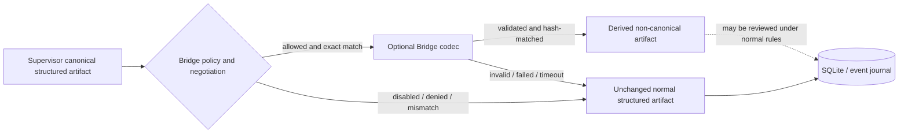

# Project_Bridge integration

Status: **FOUNDATION**, not complete integration.

Project_Bridge is an optional cognitive/communication plane. Supervisor remains the control plane,
Workers remain the execution plane, and Cyber Office remains the human interface. SQLite, task
records, the append-only event journal, normal JSON artifacts, and files remain canonical. A Bridge
message is never authority and never canonical state.

## Evidence boundary and provenance

The local Project_Bridge research repository was inspected at its `README.md`, `PROTOCOL.md`, and
`prototype/bridge_proto/payload.py`. At inspection time it described a research program, an
experimental Bridge Envelope v0.1, typed-fidelity claims, verbatim integrity, a claims-only hash,
and capability-negotiation experiments. It did **not** provide a production Fabric runtime contract.
Its repository also had no license file granting code-reuse rights.

No Project_Bridge source code is copied here. The Fabric implementation is project-owned code based
on the high-level integration boundary requested for CHIPS Agent Fabric. The identifiers
`fabric-bridge/1.0` and `identity-json/1.0` deliberately name the Fabric boundary rather than
claiming wire compatibility with Project_Bridge's experimental `bridge: "0.1"` envelope.

## Implemented foundation

The package `project_supervisor.bridge` provides:

- an optional `BridgeCodec` protocol;
- exact-string version and codec capability negotiation;
- a deterministic, offline identity JSON codec for tests and integration development;
- bounded canonical JSON validation;
- a full-envelope SHA-256 that covers message, sender, receiver, task, codec, version, and payload;
- non-authoritative derived artifacts;
- privacy-safe telemetry; and
- deterministic reason-coded fallback to the unchanged structured source artifact.

The feature is disabled by default. Enabling this foundation does not connect a model, discover a
peer, modify the scheduler, or establish a network transport.

## Control-plane boundary



The returned `DerivedBridgeArtifact` has `authoritative=false`, `canonical=false`, and
`stateUse=derivedOnly`. A caller must pass it through the same normal verification and persistence
rules as other untrusted Worker output. The Bridge path cannot mutate state by itself.

## Negotiation

Each peer advertises only static, programmatic facts:

- opaque peer ID;
- availability;
- exact supported protocol-version strings;
- exact supported codec-ID strings; and
- maximum payload bytes.

Negotiation uses an exact intersection. There is no semantic-version guessing, downgrade coercion,
model self-report, or prefix matching. The first exact match in the local peer's declared preference
order is selected, and the smaller advertised payload limit wins. No common version produces
`versionMismatch`; no common codec produces `codecMismatch`; an unavailable peer produces
`unsupported`.

## Envelope and integrity

The v1 Fabric envelope is schema-defined in `schemas/bridge-envelope-v1.schema.json`:

```json
{
  "bridgeVersion": "fabric-bridge/1.0",
  "codecID": "identity-json/1.0",
  "messageID": "opaque",
  "senderID": "opaque",
  "receiverID": "opaque",
  "taskID": "opaque",
  "payload": {
    "artifactID": "opaque",
    "artifactType": "review",
    "content": {}
  },
  "envelopeSha256": "64-lowercase-hex"
}
```

The hash is SHA-256 over canonical UTF-8 JSON of every preceding envelope field. The hash field
itself is excluded to avoid self-reference. This is intentionally stronger and differently scoped
than Project_Bridge's experimental claims-only hash. It proves deterministic byte-level integrity,
not sender authenticity; authenticated transport and node identity remain separate requirements.

Objects reject unknown top-level fields. Runtime validation also limits payload bytes, envelope
bytes, nesting depth, total container items, individual string bytes, invalid UTF-8, non-JSON types,
and non-finite numbers. JSON schemas provide a portable shape contract; Python validation enforces
the resource bounds that JSON Schema cannot express reliably.

## Authority exclusions

The caller must classify transfer context before encoding. All of these classes are prohibited from
the Bridge path and deterministically fall back with `forbiddenAuthority`:

- RED actions or approvals;
- production code writing, patches, or repository edits;
- credentials, bearer material, cookies, keys, or credential requests;
- capability grants or revocations;
- tool-call authority; and
- shell commands or shell authority.

This is an explicit control-plane check, not a claim that semantic scanning can reliably recognize
every unsafe sentence. Callers remain responsible for classification and normal Supervisor policy.
Worker prose cannot grant authority regardless of which data plane transported it.

## Deterministic fallback

On every failure, `BridgeDelivery.source` retains the unchanged normal `StructuredArtifact` and no
derived artifact is accepted.

| Reason code | Meaning |
|---|---|
| `disabled` | Bridge was not explicitly enabled. |
| `forbiddenAuthority` | The context contains an authority class that Bridge may not carry. |
| `unsupported` | A peer is unavailable or the negotiated codec is not locally implemented. |
| `versionMismatch` | There is no exact protocol-version intersection. |
| `codecMismatch` | There is no exact codec-ID intersection. |
| `validationFailed` | Input, encoded data, decoded metadata, or strict fields are invalid. |
| `payloadLimit` | The source exceeds a local or peer-advertised bound. |
| `hashMismatch` | The full decoded envelope differs from the encoded envelope or its hash fails. |
| `decodeFailed` | The codec fails without exposing its private exception text. |
| `timeout` | Encoding or decoding exceeds the configured operation timeout. |

These codes are stable machine decisions. A model cannot override them, and a failure never silently
switches to a weaker Bridge version or codec.

## Telemetry privacy

`schemas/bridge-telemetry-v1.schema.json` allowlists only opaque exchange/peer IDs, protocol and
codec IDs, hashes, byte sizes, integer latency, availability, and fallback reason. It contains no raw
payload, prompt, decoded text, exception detail, credential, model response, or capability grant.
This telemetry measures the data-plane attempt; it does not turn derived content into canonical
evidence.

## What is not implemented

- no real Project_Bridge encoder or decoder;
- no AI/model invocation;
- no network endpoint or transport;
- no Project_Bridge handshake/probe execution;
- no compression-quality or decode-confidence claim;
- no scheduler routing based on Bridge support;
- no persistence/migration for Bridge artifacts or telemetry;
- no Cyber Office presentation; and
- no claim of Project_Bridge protocol compatibility.

A future complete integration requires a licensed/versioned Project_Bridge contract, authenticated
peer transport, real codec conformance tests, adversarial validation, deterministic fallback tests,
quality evidence, and a separate scheduler/API ADR. Until those gates pass, normal structured
communication is the production path.

## Verification

The offline foundation uses no credentials, model quota, or network:

```sh
.venv/bin/pytest -q tests/test_bridge_foundation.py
.venv/bin/ruff check --no-cache src/project_supervisor/bridge tests/test_bridge_foundation.py
```

The tests cover disabled-by-default behavior, exact negotiation, schema validation, full-envelope
tamper detection, strict fields and bounds, every prohibited authority class, unchanged fallback,
validation/hash/decode/timeout reason codes, and absence of raw payload in telemetry.
